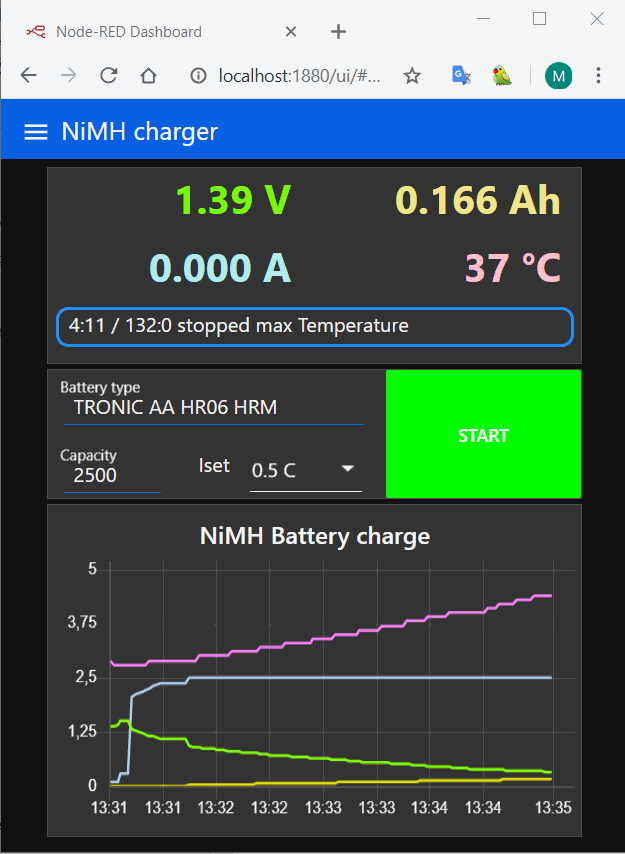
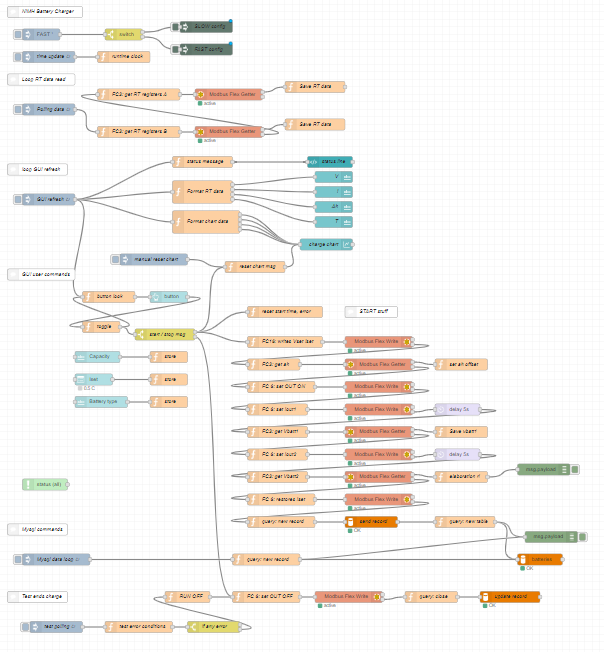

NiMH_charger_logger v 2.0
=========================

This *flow* uses the RD6006 to get a simple but complete NiMH battery charger-logger.

 Config values are set for 2 options:

- **SLOW charge**, constant tension (1.47-1.50), low current (C/40.. C/10), time very long, also continous charging. 
- **FAST charge**, constant current (<= 1.2 C), high tension (5 V), until one hour charge.

 

End charge conditions:

- by user (STOP button)
- by RD6006 (OVP, OCP, OTP, Iout<10 mA)
- added test: Vbatt > Vmax
- added test: Tbatt > Tmax
- added test: chargeAh > Ahmax

The charge (Ah) is reset to 0 every START (in the RD6006 Ah is reset only at startup).
The battery V value can be get also in *smart* mode: because the RD6006 don't allows Iout=0, the internal resistence is calculated from a differential measure at startup, so Vsmart = Vbatt - Iout*Ri.

Every charge cicle generates a new mySQL table, with records stored every 5 sec, and a definition record on the index table 'batteries'. 

**Installation**

- A ***WAMP*** (or LAMP...) is required to have *mySQL* and *phpMyAdmin*.
- Add to the ***node-red** palette* the package *node-red-node-mysql*
  (see [https://flows.nodered.org/node/node-red-node-mysql](https://flows.nodered.org/node/node-red-node-mysql "node-red-node-mysql"))
- Copy the contents of the file [NiMH_charger_RD6006.json](NiMH_charger_RD6006.json "NiMH_charger_RD6006") to the clipboard and import it into a new flow in ***node-red***.
- The values in *'SLOW config'* and *'FAST config'* nodes can be modified to suit your needs.
